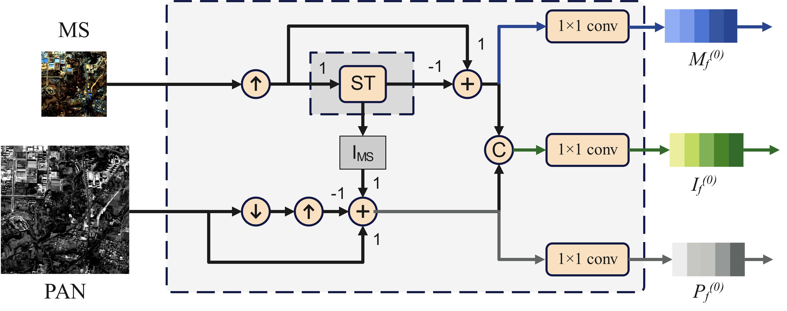
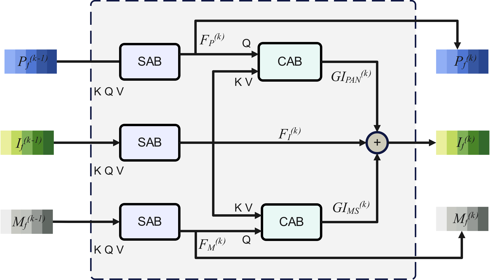

# CIGformer

## CIGformer

---
This is the official implementation of ["CIGformer: A Transformer-Based Pansharpening Network Through Continuous Information Guidance"]

The original github address of this code is [hangfrieddays/CIGformer (github.com)](https://github.com/hangfrieddays/CIGformer)

## Overview of CIGformer


## Architecture of ISBlock


## Architecture of IGBlock


### Requirements
This environment is mainly based on python=3.6 with CUDA=10.2

```shell
conda create -n CIGformer python=3.10
conda activate CIGformer
conda install pytorch=1.7.1 torchvision=0.2.2 cudatoolkit=10.2
pip install mmcv==1.2.7
conda install gdal=3.1.0 -c conda-forge
conda install scikit-image=0.17.2
pip install scipy==1.5.3
pip install gpustat==0.6.0
pip install numba==0.53.1 
pip install einops==0.3.0 
pip install timm==0.3.2
pip install sewar==0.4.4
```

### Create Dataset
```shell
cd ./utils
python handle_raw.py
python clip_patch.py
```

### Train CIGformer

Due to the large size of the dataset, we only provide some samples in './data' to verify the code.

```shell
conda activate CIGformer
export CUDA_VISIBLE_DEVICES='0';
# train TransferNetwork
python transfertrain.py

# train CIGformer
python fusiontrain.py
```

you can pass hyper-parameters below:

* pretrained = False
* log_pth = 'path to save your training log'
* log_name = 'CIGformer'
* config_pth = 'records/CIGformer/config.yml'


You can modify the config file 'models/model.py' for different purposes.

# Citing CIGformer

Consider cite CIGformer in your publications if it helps your research.
